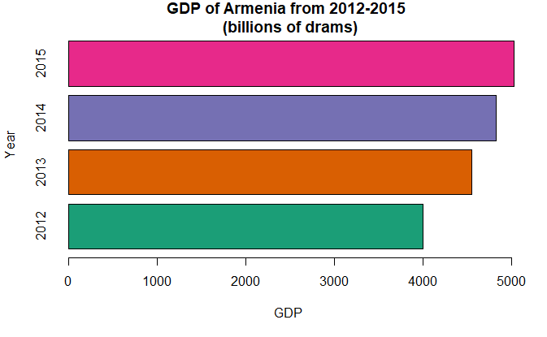
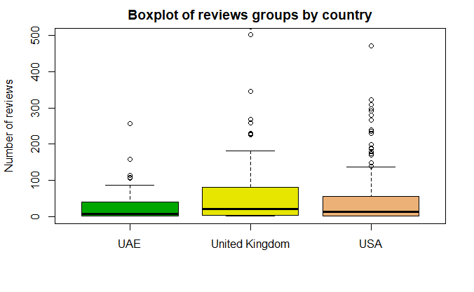

  
```{r setup, include = FALSE}
knitr::opts_chunk$set(echo = F)
# load the required libraries used in the HW
if (!require("pacman")) install.packages("pacman")
pacman::p_load(stringr, dplyr, lubridate)
```


***

# Requirements 
  
**File format:** *For this Homework, you are required to submit both R Markdown and __HTML__ files with your answers and codes in it. Make sure that Rmd file works, so that there won't be any errors when it is run and represent the same information as HTML. Under each question (not in comments) write the code along with your interpretations. Be sure to put your name at the top of your assignment (in the YAML header in front of the author).*

**Due date:** *21.11.19 23:55. No late homework will be accepted.*

**Submission:** *You need to submit files in <b>private</b> [GitHub repository](https://help.github.com/en/articles/create-a-repo) and [share](https://help.github.com/en/articles/inviting-collaborators-to-a-personal-repository) with [me](https://github.com/Zilfimian). Then, share the link to your repository on Slack.*

**Rule of thumb:** *If the number of data points is greater than 100, do not print the whole data. Use subsets. Try to show all outputs (do not just store object as a variable). Also, try to avoid using the same name for variables in the file.*

**Cheating:** *The purpose of tasks is to check your knowledge (rather than the ability of thinking). Please, try to solve without googling __every__ exercise. Try not to discuss with your classmates and work only on your file. Any similarities, which can be considered as cheated, will not be graded.*


***


<style>
div.green { background-color:#F0FFFF; border-radius: 5px; padding: 30px;}
</style>


# Task 1 (2 points): Regular Expressions 1 (+ stringr)

<div class = "green">

***
**Pay attention to whitespaces, letter case and order of the words. Do not change anything in the format of suggested examples.**

***

 a. Create a vector containing the following characters: 

```
"Levon Aronian"
"   Gabriel 1983 Sargissian"
"Melkumyan Hrant"
"/101 Vladimir1991 Akopian1971  ".
```

Build a regex pattern to extract only the first names of the people (show the result). 

 b. Create a vector containing the following characters: 

```
"Akhmatova 1889-1966", 
"1880-1921 Blok",
"Balmont 1867.1942 K"
```

Find the regex pattern (**one**) to extract the year of birth and death and surname of the poets. Create a data frame of these 3 variables: `Surname`, `Birth`, `Death`.

 c. Create the function which takes a vector of characters as an argument and returns the vector of characters (with the same length) with the capitalized first letter of **each** word (remaining letters should be lower-case). Use the functions only from the package `base`. Show the result of some vector of strings.

```
Example:
input - c("the fiRst strIng", "thE second sTRING")
output - [1] "The First String"  "The Second String"
```

 d. Create a vector containing the following 4 characters:

```
"Joe Satriani July 15, 1956", "jul steve vai1960", "Yngwie Johann Jul 1963 Malmsteen " and "1942 Nov Jimi Hendrix".
```
Build the regex patterns to extract the **full** names (with upper-case first letters) of guitarists who were born in July.

</div>

<br>

## Solution 1
```{r}
#a.
v = c("Levon Aronian", "   Gabriel 1983 Sargissian", "Melkumyan Hrant", "/101 Vladimir1991 Akopian1971  ")
is.character(v)

m = regexpr("[A-Z][a-z]+", v, perl=T)
regmatches(v, m)
#b.
vb = c("Akhmatova 1889-1966", 
"1880-1921 Blok",
"Balmont 1867.1942 K")

ms = regexpr("^[A-Z][a-z]+", vb)
sur = regmatches(vb, ms)
sur

f = sub("^\\D*(\\d+).*$", "\\1", vb)

s = sub('.*(\\d{4}).*', '\\1', vb)

df = data.frame("Surname" = sur, "Birth" = f, "Death" = s)
df

#c.
vc <- c("the fiRst strIng", "thE second sTRING")
CapStr <- function(y) {
  ve = c()
  for (i in 1:length(x)) {
    x = y[i]
  c <- strsplit(x, " ")[[1]]
  ve = c(ve, paste(toupper(substring(c, 1,1)), substring(c, 2),
      sep="", collapse=" "))
  }
  return (ve)
}
vv = CapStr(vc)
vv

#d.
vd = c("Joe Satriani July 15, 1956", "jul steve vai1960", "Yngwie Johann Jul 1963 Malmsteen ", "1942 Nov Jimi Hendrix")
vd1 <- grep("Jul+", vd, perl=T, value = T)
git = word(vd1, 1,2, sep=" ")
git

a = 0

```


# Task 2 (1 point): Regular Expressions 2 (+ stringr (+Basic Plotting))

<div class = "green">

***

**Download the file HW3.txt (uploaded on Google Drive).**

***

 a. Cleaning: show only the first line without warnings. Eliminate the periods *before* and *after* the words, but **not** periods *inside the values* and *at the end of the statement*.

 b. Show only the second line without warnings. Convert the GDP of Armenia into proper numbers, create a data frame with variables `Year` and `GDP`. 

 c. Plot the following graph using the result from b (pay attention to axes, legend/s, title/s):

<center>



</center>

</div>

<br>

## Solution 2

# Task 3 (2 points): String Manipulation + Basic Plotting

<div class = "green">

***
**Use HW.csv dataset uploaded on GD which contains information about reviews of different guesthouses. Note: keep the order of subtasks.**

***

 a. Data Cleaning

Load the file. A string variable should be a character (not a factor). Use appropriate function/s to understand the structure (variable types, basic description, number of observations) of the data. Get rid of the variable/s that cannot be useful in the analysis of reviews.

Create the *date* variable for the column `Review_year` in the following format - "2014-01-01". 

Check whether the data types are correct, if not make appropriate corrections. Change the type of variables from characters to factors if the length of their unique values is less than 8.

Show the classes of variables in the final data.


 b. **Create** (not subset) the vector of characters containing 10 guesthouse names, select the names from the data (either clean or messy).

Filter the data in a way that all **visit years** are from 2013, the hotels are among the created guesthouses and the number of characters of reviews not less than 200.

Comment on the dimension of the initial and final data.

**Note:** The variable `Review_object_name` is messy.

```
Messy: c("  areg hotel  ", "   ibis yerevan center hotel  ",...)
Clean (preferable): c("Areg Hotel", "Ibis Yerevan Center Hotel",...)
```

You need to convert the column `Review_object_name` to appropriate format and then filter the data.

 c. How many unique `Review_object_name` contains the word "Hotel" as a first word? Use the function `srt_split` (the result should be a matrix) for this subtask. 

 d. Create a subset of initial data, which contains information about reviews from the United Kingdom, the United Arab Emirates and the United States of America. Use the column `Country` for this subtask. (The usage of the regex is mandatory.) Comment on the dimension of the data.

 e. Plot the following graph (pay attention to axes, legend/s, title/s):
 
 <center>
 
 
 
 </center>
 
**Note:** the number of reviews should be corrected using `POSIX character classes`.

 f. Create the new variable for the subset of data (from d) which contains information about the number of occurrences of the word "good" reviews. Do the same for the word "bad". Find the average values of variables grouped by the three selected countries.
**Note:** Not all the letters of reviews are lowe-case. 


</div>

<br>

## Solution 3


# Task 4 (2 points): Lubridate

<div class = "green">

The information below represents records from my summer plan-book about learning to play piano in **Gyumri**:

 * start - the time I sat in front of the instrument
 * stop - the time I stopped playing 
 * learn - actual time I played the piano

```{r echo=TRUE}
start <- c("01062016, 12:00", "02062016 14:51",   "03062016 18:09", "04062016 12:43",
  "06062016, 17:41", "05072016, 17:27",  "08082016, 22:47")
stop <- c("2016-06-01 14:30:48", "2016-06-02 17:20:46", "2016-06-03 20:39:07",
"2016-06-04 15:13:40", "2016-06-06 20:10:51", "2016-07-05 19:56:54", "2016-08-09 01:17:48")
learn <- c(1.69, 2, 1.58, 1.5, 1, 0.5, 2.5)
```
 
 a. Create a data frame using these 3 variables. Use functions from `lubridate` to change the types of the variables appropriately. 

 b. Calculate the average of each column. Interpret the results.

 c. How much time has passed since my last attempt of learning to play piano?
 
 d. Compute my real productivity of learning.
 
 e. My least productive session (subset this value) is explained by the skype call of my friend from Berlin. When did he call me (by his time)?  
 

</div> 

## Solution 4

# Task 5 (1 point): Questions 

<div class = "green">

 a. The package `base` provides useful functionality for text manipulations. Why do we need another package `stringr`? Bring an example of the benefits of using `stringr`.

 b. Could you use the function from package `base` or `chron` to solve the task 4? Why?

 c. Describe the differnce between three classes of timespans of `lubridate` package. Bring the meaningful example of each one.

</div> 


## Solution 5
