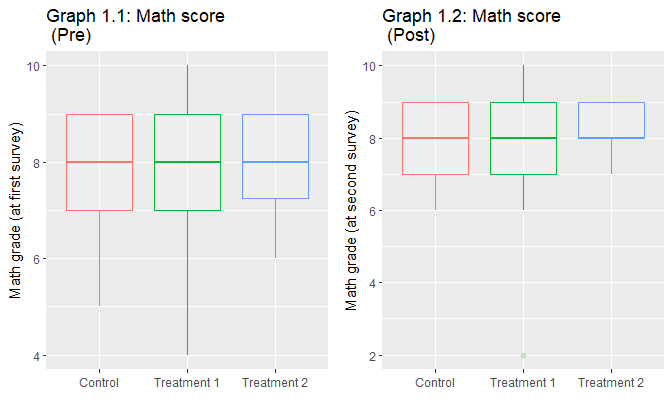
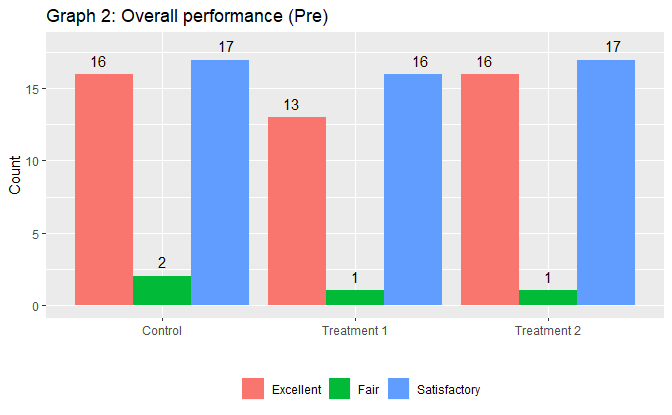
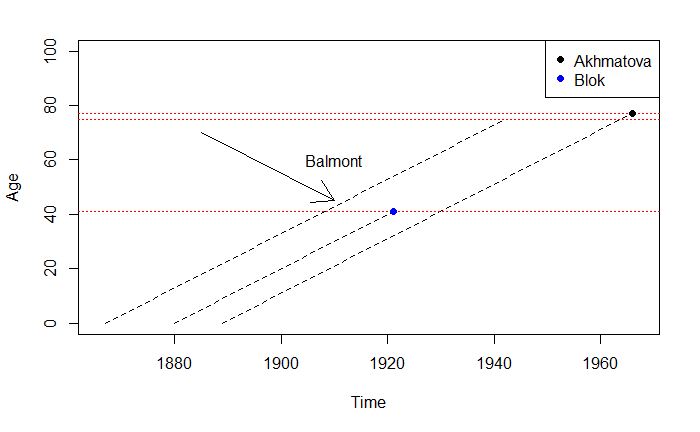
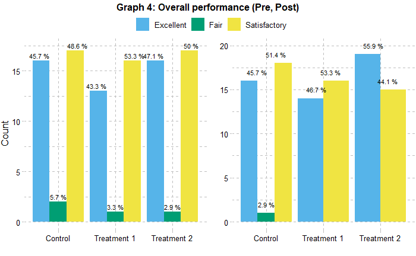

  
```{r setup, include = FALSE}
knitr::opts_chunk$set(echo = F)
# load the required libraries used in the Midterm
if (!require("pacman")) install.packages("pacman")
pacman::p_load(stringr, dplyr, lubridate, ggpubr)
```

***
<center>
<h3>
Yerevan State University <p>
Faculty of Mathematics and Mechanics <p>
Applied Statistics and Data Science  <p>
R programming <p>
<b> 
Midterm Exam 
</b><p>
</h3>
25 November 2019 <p>
<i> 
Exam Duration: 1.3 hours. <p>
</i>
<b>READ THESE INSTRUCTIONS CAREFULLY</b>
</center>

***

<style>
div.blue { background-color:#e6f0ff; border-radius: 5px; padding: 20px;}
</style>


<div class = "blue">

Start by filling in your First and Last names in the YAML header (in front of the author). <p>
This test consists of 3 sections: <p>

 * Data Cleaning (**3 pt.**) 
 * Data manipulation and visualization (**3 pt.**)
 * Sting Manipulation + Regex (**2 pt.**) 
 
<br>
Overall test grade is 8 points. 
<br>
This is an open-book test: you can use your notes, books, codes or other materials. <br>
<b>
Please turn off your cell phones and place them out of reach. <br>
Talking to another student, looking at another student's computer, or communicating with other students in any way is strictly forbidden. 
<br>
</b>

For this exam, you are required to submit both Markdown and **HTML** files with your answers and code in it. Make sure that Rmd file works, so that there won’t be any errors when it is run and represent the same information as HTML. Under each question (not in comments) write the code along with your interpretations. Do not remove problems from your Markdown file. <br>

**Good luck!**
<p>
</div>
<br>

***


<div class = "blue">

# Task 1 (3 points): Data Cleaning 

 ***

Use **surveydata.csv** dataset uploaded on Google Drive to analyze the relationship between characteristics of resondents. The description of the variables is given with a separate file.

 ***

 a. Import the file into R. Convert all missing values to NAs (**Note:** there are **5** different types of NAs in the data)
 b. Use loop/s to show the number of missing values for each variable.
 c. There are human-made errors in one of the variables. Solve the problem without losing the information.
 d. Create a new variable for respondents' age at the time of the survey.
 e. (e1) Which two variables do provide the same information? Drop one of them along with another irrelevant variable/s. 
  (e2) Check whether the data types are correct, if not make appropriate corrections assigning labels to each level according to the data description. 
  (e3) Change the name of variable `TT` to `TreatmentType`.
  (e4) Drop the missing values.
 Use functions (and pipe operators) from `dplyr` package to solve the task.  
 
</div>

## Solution 1
```{r}
#a.
data = read.csv("surveydata.csv", header = TRUE, na = c(100, 99, 98, " "))
str(data)
head(data)
for(i in colnames(data)) {
  for (j in 1:length(data[[x]])) {
    if(data[[x]][j] %in% c(100, 99, 98, " ")) {
      data[[x]][j] = NA
    }
  }
}

#b
for(i in colnames(data)) {
  s = 0
  for (j in 1:length(data[[x]])) {
    if(is.na(data[[x]][j])) {
    s = s+1
    }
  }
  cat(s, " ")
}

#c


a = 0
```


<div class = "blue">

 ***

# Task 2 (3 points): Data Manipulation and Visualization

 a. Find **the numeric** variable with the highest variability. Show its variance.
 
 b. Is there any difference between math grades of the first and the second surveys grouped by treatment status? To solve the task compare the following statistics/measures: number of observations, average value, median. (Hint: **dplyr**) 
 
 c. Plot the following graph (pay attention to axes, legend/s, title/s):

<center>

{width=500px}
</center>

<br>
 d. Plot the following graph (pay attention to axes, legend/s, title/s, text/s). (Hint: **dplyr:)**) 
<br>

<center>

{width=500px}
</center>

</div>

<br>

## Solution 2
```{r}
#a
s = 0
for(i in colnames(data)) {
  if(is.numeric(data[[i]])) {
    s1 = max(data[[i]], na.rm = T)
    if (s1 > s) {
      s = s1
    }
  }
}
print(s)

#b.
head(data)
mean(data$Pre_P1) == mean(data$Post_P1)
median(data$Pre_P1) == median(data$Post_P1)

#c
boxplot(data$)


```


***

<div class = "blue">

# Task 3 (2 points): String Manipulation + Regex
 
 a. Consider the text below:
 
```{r echo=TRUE}
text <- 'American singer/songwriter Billie Eilish has released one studio album, two EPs, 20 singles, and 16 music videos. In 2016 she released 2 songs - "Six Feet Under", and "Ocean Eyes"; in 2017 the following songs - "Bellyache", "Bored", "Watch", "Copycat", "Idontwannabeyouanymore", "My Boy", "&Burn"; in 2018 these songs -  "Lovely", and "Party Favor", "When the Partys Over", "When I Was Older"; in 2019 the following songs - "Bury a Friend", "Bad Guy", and "Everything I Wanted" '
```
 
 Create a data frame with two variables: year and the **number of songs** released in the corresponding year.
 
 b. Create a vector containing the following characters: 

```
"Akhmatova 1889-1966", 
"1880-1921 Blok",
"Balmont 1867.1942 K"
```

Find the regex pattern (**one**) to extract the year of birth and death and surname of the poets. Create a data frame of these 3 variables: `Surname`, `Birth`, `Death`.

 c. (**Supplementary**) Plot the following graph using the result from b. Pay attention to axes and legend.
 
 <center>
{width=500px}
</center>


</div>

<br>

## Solution 3
```{r}
#a
v <- strsplit(text, ";")[[1]]

m = regexpr("\\d{4}", v )
years = regmatches(v, m)
years
c = str_count(string= v, pattern=',')
c = c+1
c[1] = 2
c

df = data.frame("years" = years, 'count' = c)
df
#b
vb = c("Akhmatova 1889-1966", 
"1880-1921 Blok",
"Balmont 1867.1942 K")
ms = regexpr("[A-Z][a-z]+", vb)
sur = regmatches(vb, ms)
sur

f = sub("^\\D*(\\d+).*$", "\\1", vb)

s = sub('.*(\\d{4}).*', '\\1', vb)

df = data.frame("Surname" = sur, "Birth" = f, "Death" = s)
df


```


<div class = "blue">

# Bonus (Supplementary 2 )

<small>

 a. Create a function that takes the categorical variable as an argument and returns a table with the number and percentage of each category (e.g. males and females) in each group of treatment status. The columns of final table will be:

 * Treatment Type
 * Categorical Variable Name
 * Number of observations
 * Percentage

 b. Plot the following graph:
 
<center> 
 {width=500px}
</center> 
</small>

</div>